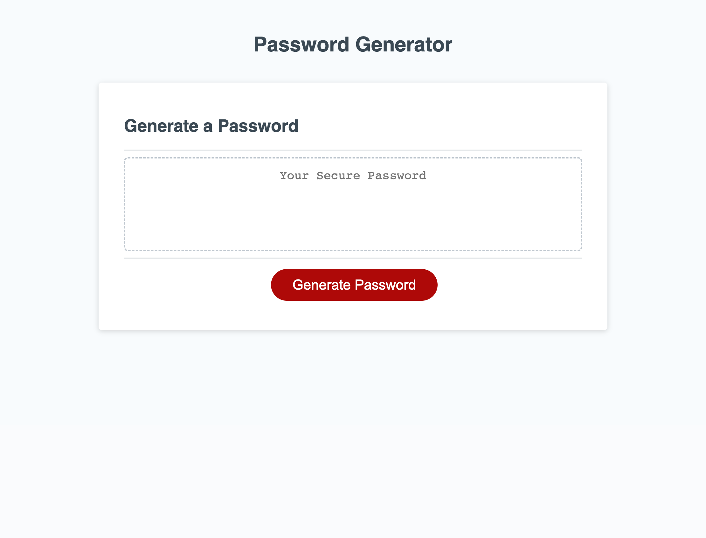

# 03 JavaScript: Password Generator

## Your Task

This week's Challenge requires you to modify starter code to create an application that enables employees to generate random passwords based on criteria that they’ve selected. This app will run in the browser and will feature dynamically updated HTML and CSS powered by JavaScript code that you write. It will have a clean and polished, responsive user interface that adapts to multiple screen sizes.

The password can include special characters. If you’re unfamiliar with these, see this [list of password special characters](https://www.owasp.org/index.php/Password_special_characters) from the OWASP Foundation.

## User Story

```
AS AN employee with access to sensitive data
I WANT to randomly generate a password that meets certain criteria
SO THAT I can create a strong password that provides greater security
```

## Acceptance Criteria

```
GIVEN I need a new, secure password
WHEN I click the button to generate a password
THEN I am presented with a series of prompts for password criteria
WHEN prompted for password criteria
THEN I select which criteria to include in the password
WHEN prompted for the length of the password
THEN I choose a length of at least 8 characters and no more than 128 characters
WHEN asked for character types to include in the password
THEN I confirm whether or not to include lowercase, uppercase, numeric, and/or special characters
WHEN I answer each prompt
THEN my input should be validated and at least one character type should be selected
WHEN all prompts are answered
THEN a password is generated that matches the selected criteria
WHEN the password is generated
THEN the password is either displayed in an alert or written to the page
```

## Notes and Description of Work
Message will be displayed when the user selects a password length of less than 8 and greater than 128.
I've set it up so that it will write the message "Please try again" in the password generator field. 
An error message will also be displayed if the user doesn't select at least 1 of the 4 options for the password.

I used a class to store the users 4 inputs from the getSelection function. This way the program knows how 
many iterations to run based on how many inputs were selected up front. This is then passed into the generateRandom function
which uses a switch case to iterate through the user's selections. There are 4 arrays which have the various choices available:
lowercase, uppercase, numbers and special characters. I've included a guarantee clause to make sure that at least one character
of each user input is written to the final password. Password array is shuffled several times to ensure randomness before final 
password is generated and written to the display. 

## Screenshots of Final App
*Final landing page*

* Here is what it looks like when the password is generated. In this case user selected length of 12 and all 4 variables:

*Final password generated*

## Deployed link
Please find the deployed link here: https://ionscion.github.io/didactic-countersign-gen/

